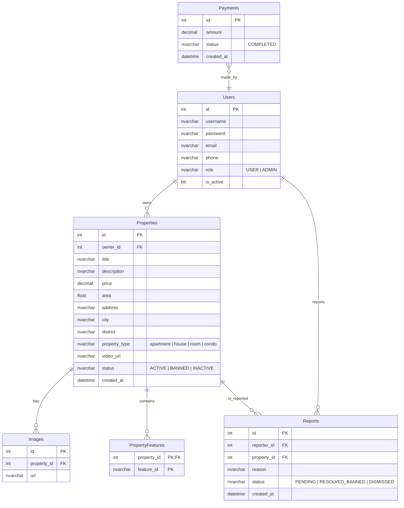
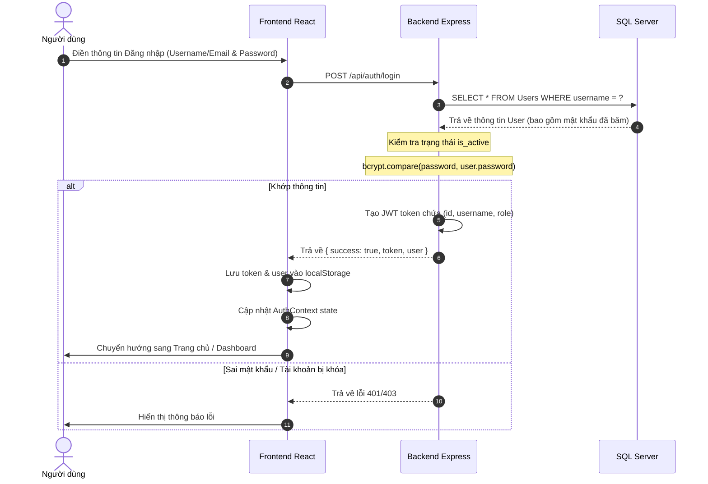
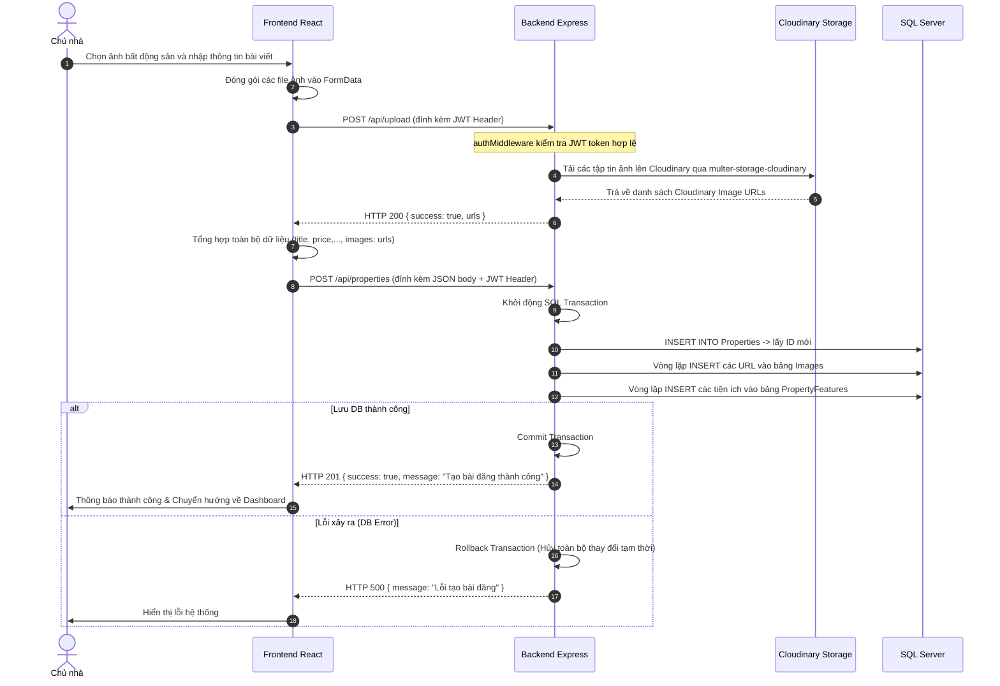
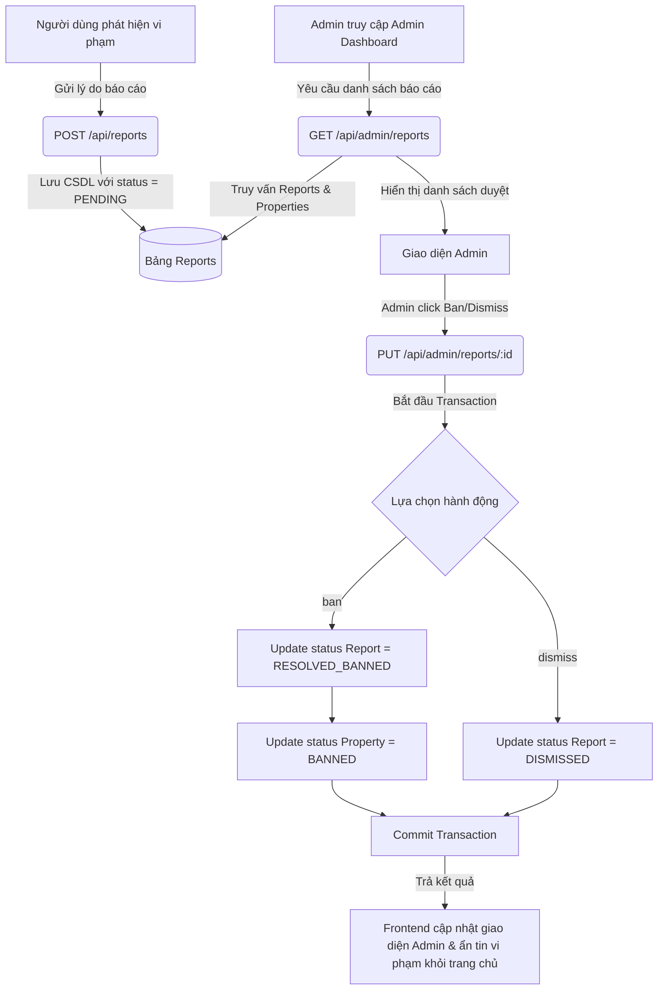

# BÁO CÁO CHI TIẾT DỰ ÁN RENTHUB - HỆ THỐNG KẾT NỐI CHO THUÊ BẤT ĐỘNG SẢN

Báo cáo này cung cấp cái nhìn toàn diện về kiến trúc công nghệ, mô hình dữ liệu và các luồng logic nghiệp vụ chính của hệ thống RentHub.

---

## 1. Tổng Quan Dự Án
**RentHub** là một nền tảng Web cho phép người dùng đăng tin cho thuê và tìm kiếm các loại bất động sản (phòng trọ, căn hộ, chung cư, nhà nguyên căn). Hệ thống bao gồm hai giao diện chính:
*   **User Portal:** Dành cho người tìm kiếm và người cho thuê (đăng bài, cập nhật trạng thái, chỉnh sửa và quản lý tin đăng của mình).
*   **Admin Dashboard:** Dành cho quản trị viên theo dõi số liệu thống kê (doanh thu, cơ cấu tin đăng) và xử lý báo cáo vi phạm tin đăng từ phía người dùng.

---

## 2. Danh Sách Công Nghệ Sử Dụng (Technology Stack)

### Giao Diện (Frontend)
*   **Framework chính:** React 18+ (sử dụng [Vite](file:///d:/Web%20Landing%20Page%20Design/vite.config.ts) để build & chạy dự án cực nhanh).
*   **Ngôn ngữ:** TypeScript (đảm bảo kiểm soát kiểu chặt chẽ, giảm thiểu lỗi runtime).
*   **Định tuyến (Routing):** [React Router v7](file:///d:/Web%20Landing%20Page%20Design/src/app/routes.tsx) (`createBrowserRouter`), hỗ trợ điều hướng mượt mà không load lại trang.
*   **Quản lý trạng thái (State Management):** [AuthContext](file:///d:/Web%20Landing%20Page%20Design/src/app/context/AuthContext.tsx) (React Context API) quản lý trạng thái đăng nhập toàn cục.
*   **Giao diện và Styling:**
    *   **Tailwind CSS v4:** Công cụ styling chính cho tốc độ phát triển giao diện nhanh.
    *   **Radix UI / Shadcn UI Primitives:** Các component UI nền tảng như Dialog, Accordion, Dropdown,...
    *   **Lucide React:** Bộ icon SVG tối giản và hiện đại.
    *   **Recharts:** Vẽ biểu đồ trực quan hóa dữ liệu thống kê trên Admin Dashboard.

### Máy Chủ (Backend)
*   **Runtime:** Node.js.
*   **Framework:** [Express.js](file:///d:/Web%20Landing%20Page%20Design/backend/src/app.js) - xây dựng RESTful API linh hoạt và nhẹ nhàng.
*   **Xác thực bảo mật:**
    *   `jsonwebtoken` (JWT): Tạo và xác minh mã token truy cập cho các request được bảo vệ.
    *   `bcryptjs`: Mã hóa một chiều mật khẩu người dùng trước khi lưu vào cơ sở dữ liệu.
*   **Xử lý File & Media:**
    *   `multer` & `multer-storage-cloudinary`: Middleware nhận diện tập tin upload từ client và chuyển trực tiếp tới Cloud Storage.

### Cơ Sở Dữ Liệu & Dịch Vụ Lưu Trữ (Database & Storage)
*   **Hệ quản trị CSDL:** Microsoft SQL Server (MSSQL), kết nối qua thư viện `mssql` của Node.js với cơ chế Parameterized Query để ngăn chặn tấn công SQL Injection.
*   **Lưu trữ đám mây:** Cloudinary - Lưu trữ hình ảnh và video chất lượng cao với CDN tối ưu hóa tốc độ tải.

---

## 3. Kiến Trúc Cơ Sở Dữ Liệu (Database Schema)

Dựa trên cấu trúc truy vấn trong backend, cơ sở dữ liệu **RentHubDB** được thiết lập với 6 bảng chính sau:

---

## 4. Các Luồng Logic Nghiệp Vụ Chính (Core Logical Flows)

### 4.1. Đăng ký & Đăng nhập (Authentication Flow)

Luồng xác thực của hệ thống sử dụng cơ chế Token-based Authentication qua JWT.

---

### 4.2. Đăng tin & Tải ảnh lên (Post Property & Upload Flow)

Quá trình đăng một bất động sản mới bao gồm hai giai đoạn liên tiếp: tải ảnh lên Cloudinary để lấy link ảnh CDN, sau đó gửi tất cả dữ liệu text + link ảnh về Server để thực hiện lưu trữ dạng Transaction.

---

### 4.3. Tìm kiếm & Lọc (Search & Filter Flow)

Khách truy cập có thể tìm kiếm bất động sản theo Địa điểm, Loại hình và khoảng Giá. Luồng xử lý ở backend được tối ưu hóa để tránh lỗi truy vấn $N+1$ khi tải danh sách ảnh đi kèm.

1.  **Frontend gửi truy vấn:** Client gửi yêu cầu dạng `GET /api/properties?city=...&property_type=...&minPrice=...&maxPrice=...`.
2.  **Backend tạo Query động:**
    *   Tạo đối tượng `mssql.Request()`.
    *   Xây dựng chuỗi truy vấn động: Thêm các điều kiện `AND p.price >= @minPrice`, `AND p.property_type = @property_type` một cách an toàn thông qua biến truyền vào.
3.  **Tải ảnh tối ưu (Tránh N+1 Query):**
    *   Sau khi có danh sách Properties, backend gọi `SELECT property_id, url FROM Images` để lấy toàn bộ dữ liệu hình ảnh hiện có.
    *   Thực hiện gom nhóm (Group) danh sách hình ảnh theo `property_id` thành một Map dạng bộ nhớ đệm trong JS.
    *   Duyệt qua danh sách bất động sản và gán mảng ảnh tương ứng từ Map trước khi trả về.
4.  **Hiển thị:** Trả dữ liệu JSON về cho Frontend hiển thị danh sách bài đăng nổi bật dạng Grid.

---

### 4.4. Quản trị viên xử lý báo cáo vi phạm (Admin Moderation Flow)

Khi một tin đăng bị báo cáo vi phạm, luồng xử lý kiểm duyệt hoạt động như sau:

---

## 5. Nhận Xét & Định Hướng Hoàn Thiện

### Ưu Điểm Hiện Tại
1.  **Bảo mật truy vấn:** Tất cả các endpoint trong controllers đều dùng **Parameterized Query** hoặc Transaction của gói `mssql`, giảm thiểu tối đa rủi ro tấn công **SQL Injection**.
2.  **Quản lý Media tốt:** Nhờ tích hợp trực tiếp `Cloudinary Storage` nên máy chủ Node.js không cần lưu trữ file vật lý trên đĩa cứng, giúp triển khai lên Cloud (Render, Heroku, AWS) rất dễ dàng.
3.  **Routing rõ ràng:** Sử dụng `ProtectedRoute` bọc ngoài các component để lọc quyền truy cập trực tiếp ngay ở client, nâng cao trải nghiệm UI.

### Hướng Phát Triển Tiếp Theo (Để Dự Án Đạt Chất Lượng Premium)
*   **Thêm luồng thanh toán thực tế:** Hoàn thiện bảng `Payments` kết hợp với cổng ví điện tử (Momo, VNPAY) hoặc Stripe để người dùng trả phí dịch vụ tin đăng nổi bật.
*   **Hệ thống chat trực tiếp:** Tích hợp `Socket.io` để người thuê có thể liên hệ và thương lượng giá cả trực tiếp với chủ nhà thông qua giao diện RentHub.
*   **Google Maps API:** Tích hợp bản đồ trực quan để người dùng tìm phòng trọ xung quanh vị trí của họ dễ dàng hơn.
*   **Xác thực nâng cao:** Bổ sung gửi mã OTP khi đăng ký hoặc thay đổi thông tin nhạy cảm.
